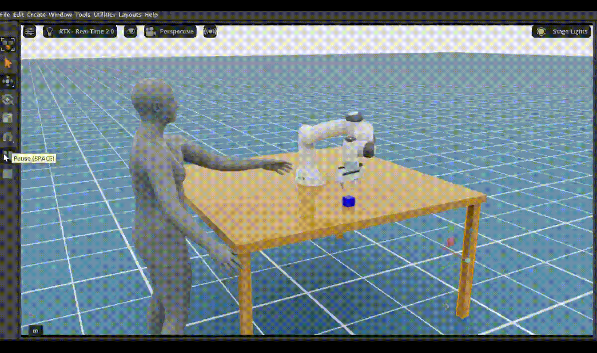

GitHub:

[https://github.com/ianmoyy11-lang/SOMA-Franka-Collaboration-Pick.git](https://github.com/ianmoyy11-lang/SOMA-Franka-Collaboration-Pick.git)

## Demo

<p align="center">
  
</p>

This guide covers the complete Windows deployment workflow:
1. Install the ZIP version of Isaac Sim 6.0.1.
2. Download and install SOMA-X.
3. Generate a SOMA-X USD with continuous left-arm waving using `export_soma_left_arm_wave_allthetime.py`.
4. Use the generated SOMA-X USD as the human asset in Isaac Sim.
5. Create the complete collaboration scene with `SOMAX_TABLE_HAND_FOLLOW.py`.
6. Let Franka grasp the Cube, verify the grasp, and continuously follow the SOMA-X left hand.

---

# 1. Project Structure
The project uses two main Python scripts:

```latex
SOMA-Franka-Collaboration-Pick
├── export_soma_left_arm_wave_allthetime.py
└── SOMAX_TABLE_HAND_FOLLOW.py
```

They run in different environments:

| File | Runtime | Purpose |
| --- | --- | --- |
| `export_soma_left_arm_wave_allthetime.py` | SOMA-X Python environment | Generate the animated SOMA-X USD |
| `SOMAX_TABLE_HAND_FOLLOW.py` | Isaac Sim 6.0.1 Python | Create Franka, table, Cube, SOMA-X, and left-hand following |


> [!IMPORTANT]  
Do not run both scripts with the same Python environment.
>

---

# 2. System Requirements
| Item | Requirement |
| --- | --- |
| Operating system | Windows 10 / Windows 11 |
| Isaac Sim | 6.0.1 ZIP package |
| Isaac Sim Python | `python.bat` included with Isaac Sim |
| SOMA-X | NVIDIA SOMA-X |
| SOMA-X Python | Separate SOMA-X virtual environment |
| Manipulator | Franka Emika Panda |
| Human model | SOMA-X |
| Scene format | OpenUSD |
| Physics engine | NVIDIA PhysX |


The Isaac Sim scene uses the 6.0.1 Experimental Franka API:

```python
from isaacsim.robot.experimental.manipulators.examples.franka import Franka
```

---

# 3. Install Isaac Sim 6.0.1 ZIP
## 3.1 Download
Official page:

[https://docs.isaacsim.omniverse.nvidia.com/6.0.1/installation/download.html](https://docs.isaacsim.omniverse.nvidia.com/6.0.1/installation/download.html)

Download the Windows ZIP package.

The file name is usually similar to:

```latex
isaac-sim-standalone-6.0.1-windows-x86_64.zip
```

---

## 3.2 Create the Installation Directory
This guide uses:

```latex
D:\IsaacSim
```

PowerShell:

```powershell
mkdir D:\IsaacSim
```

---

## 3.3 Extract Isaac Sim
Use 7-Zip or run:

```powershell
tar -xf "$env:USERPROFILE\Downloads\isaac-sim-standalone-6.0.1-windows-x86_64.zip" -C D:\IsaacSim
```

The directory should contain:

```latex
D:\IsaacSim
├── apps
├── exts
├── kit
├── standalone_examples
├── isaac-sim.bat
├── post_install.bat
└── python.bat
```

---

## 3.4 Run the Installation Script
```powershell
cd D:\IsaacSim
.\post_install.bat
```

---

## 3.5 Check Compatibility
```powershell
cd D:\IsaacSim
.\isaac-sim.compatibility_check.bat
```

---

## 3.6 Test Isaac Sim
```powershell
cd D:\IsaacSim
.\isaac-sim.bat
```

Confirm that Isaac Sim starts correctly, then close it.

---

# 4. Download SOMA-X
Official repository:

[https://github.com/NVlabs/SOMA-X](https://github.com/NVlabs/SOMA-X)

Git LFS is recommended.

```powershell
git lfs install
mkdir C:\Projects
cd C:\Projects
git clone https://github.com/NVlabs/SOMA-X.git
cd SOMA-X
git lfs pull
```

Result:

```latex
C:\Projects\SOMA-X
```

---

# 5. Install the SOMA-X Python Environment
Enter the repository:

```powershell
cd C:\Projects\SOMA-X
```

Install `uv`:

```powershell
pip install uv
```

Create the environment:

```powershell
uv venv .venv
```

Install SOMA-X:

```powershell
.\.venv\Scripts\python.exe -m pip install -e ".[dev]"
.\.venv\Scripts\python.exe -m pip install -e ".[demo]"
```

If the repository setup uses `uv pip`, use:

```powershell
.\.venv\Scripts\activate
uv pip install ".[dev]"
uv pip install ".[demo]"
```

---

# 6. Check the Required SOMA-X Assets
The animation export script requires:

```latex
C:\Projects\SOMA-X
└── assets
    ├── SOMA_neutral.npz
    └── SOMA_template_rig.usda
```

Check them:

```powershell
Test-Path "C:\Projects\SOMA-X\assets\SOMA_neutral.npz"
Test-Path "C:\Projects\SOMA-X\assets\SOMA_template_rig.usda"
```

Both commands should return:

```latex
True
```

---

# 7. Add the SOMA-X Animation Export Script
Copy:

```latex
export_soma_left_arm_wave_allthetime.py
```

to:

```latex
C:\Projects\SOMA-X\tools\export_soma_left_arm_wave_allthetime.py
```

Recommended structure:

```latex
C:\Projects\SOMA-X
├── assets
│   ├── SOMA_neutral.npz
│   └── SOMA_template_rig.usda
├── soma
├── tools
│   └── export_soma_left_arm_wave_allthetime.py
└── outputs
```

The script automatically searches for the SOMA-X repository root.

To remove ambiguity, set it explicitly before running:

```powershell
$env:SOMA_X_ROOT = "C:\Projects\SOMA-X"
```

---

# 8. Generate the Continuous Left-Arm SOMA-X USD
## 8.1 Run the Export Script
Use the SOMA-X Python environment. Do not use Isaac Sim `python.bat`.

```powershell
cd C:\Projects\SOMA-X

$env:SOMA_X_ROOT = "C:\Projects\SOMA-X"

.\.venv\Scripts\python.exe .\tools\export_soma_left_arm_wave_allthetime.py
```

---

## 8.2 Export Pipeline
The script performs:

```latex
Initialize SOMALayer
→ Prepare SOMA identity
→ Load the public rig
→ Validate bind/rest transforms
→ Generate LeftShoulder animation
→ Validate the animation
→ Export UsdSkel
→ Extend the left-shoulder wave into a continuous animation
```

The human uses:

```latex
identity_model_type = soma
lod = mid
```

Device selection is automatic:

```latex
CUDA available → cuda:0
CUDA unavailable → CPU
```

---

## 8.3 Animation Parameters
Default parameters:

```latex
FPS                         = 30
Initial animation duration  = 10 s
Arm raise duration          = 2 s
Wave period                 = 4 s
Wave angle                  = ±12°
Continuous duration         = 24 h
Sparse sample interval      = 10 frames
Animated joint              = LeftShoulder
```

Motion:

```latex
Rest Pose
→ Smoothly raise the left arm
→ Periodic LeftShoulder wave
→ Continuous looping
```

The final continuous animation stores only the `LeftShoulder` animation channel. Other joints remain at their original bound state.

---

## 8.4 Output File
The script writes:

```latex
C:\Projects\SOMA-X\outputs\demo\shape\soma_example_shape0301_male.usda
```

Check it:

```powershell
Test-Path "C:\Projects\SOMA-X\outputs\demo\shape\soma_example_shape0301_male.usda"
```

Expected result:

```latex
True
```

---

## 8.5 Expected Export Output
The terminal should show messages similar to:

```latex
SOMA-X FINAL LEFT-ARM ANIMATION -> ISAAC SIM USD

[1/7] Initializing SOMALayer...
[2/7] Preparing SOMA identity...
[3/7] Public export rig loaded...
[4/7] Verifying public USD bind/rest transforms...
[5/7] Creating custom left-arm animation...
[6/7] Validating animation for USD export...
[7/7] Exporting UsdSkel...

EXPORT SUCCESS

Continuous sparse LeftShoulder animation PASSED.
```

Continue only after the USD has been generated successfully.

---

# 9. Prepare the Isaac Sim Scene Script
Save:

```latex
SOMAX_TABLE_HAND_FOLLOW.py
```

to a project directory, for example:

```latex
C:\Projects\SOMA-Franka-Collaboration-Pick\SOMAX_TABLE_HAND_FOLLOW.py
```

Structure:

```latex
C:\Projects\SOMA-Franka-Collaboration-Pick
└── SOMAX_TABLE_HAND_FOLLOW.py
```

---

# 10. Configure the SOMA-X Input USD
`SOMAX_TABLE_HAND_FOLLOW.py` requires the environment variable:

```latex
SOMAX_FOLDER
```

Point it directly to the newly generated USD:

```powershell
$env:SOMAX_FOLDER = "C:\Projects\SOMA-X\outputs\demo\shape\soma_example_shape0301_male.usda"
```

Check it:

```powershell
$env:SOMAX_FOLDER
```

Expected output:

```latex
C:\Projects\SOMA-X\outputs\demo\shape\soma_example_shape0301_male.usda
```

> [!IMPORTANT]  
Set `SOMAX_FOLDER` in the same terminal used to launch the Isaac Sim scene.
>

---

# 11. Run the Complete Isaac Sim Scene
Use the Python included with Isaac Sim 6.0.1:

```powershell
$env:SOMAX_FOLDER = "C:\Projects\SOMA-X\outputs\demo\shape\soma_example_shape0301_male.usda"

cd D:\IsaacSim

.\python.bat C:\Projects\SOMA-Franka-Collaboration-Pick\SOMAX_TABLE_HAND_FOLLOW.py
```

---

# 12. References
## NVIDIA Isaac Sim
+ [https://docs.isaacsim.omniverse.nvidia.com/6.0.1/installation/download.html](https://docs.isaacsim.omniverse.nvidia.com/6.0.1/installation/download.html)
+ [https://docs.isaacsim.omniverse.nvidia.com/6.0.1/installation/quick-install.html](https://docs.isaacsim.omniverse.nvidia.com/6.0.1/installation/quick-install.html)
+ [https://docs.isaacsim.omniverse.nvidia.com/6.0.1/installation/install_workstation.html](https://docs.isaacsim.omniverse.nvidia.com/6.0.1/installation/install_workstation.html)

## SOMA-X
+ [https://github.com/NVlabs/SOMA-X](https://github.com/NVlabs/SOMA-X)
+ [https://nvlabs.github.io/SOMA-X/stable/](https://nvlabs.github.io/SOMA-X/stable/)
+ [https://huggingface.co/nvidia/SOMA-X](https://huggingface.co/nvidia/SOMA-X)

---

# License
SOMA-X, SMPL, SMPL-X, and related human-body assets may use different licenses.

